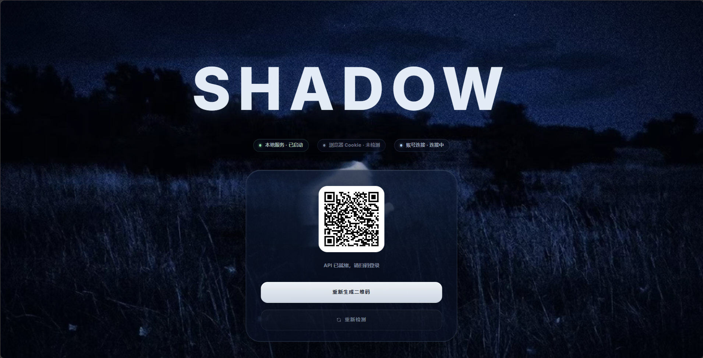
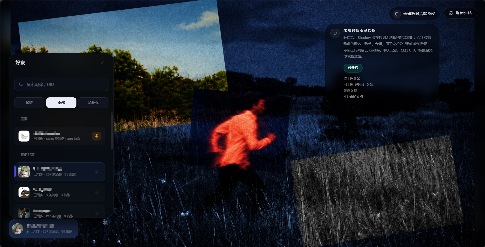
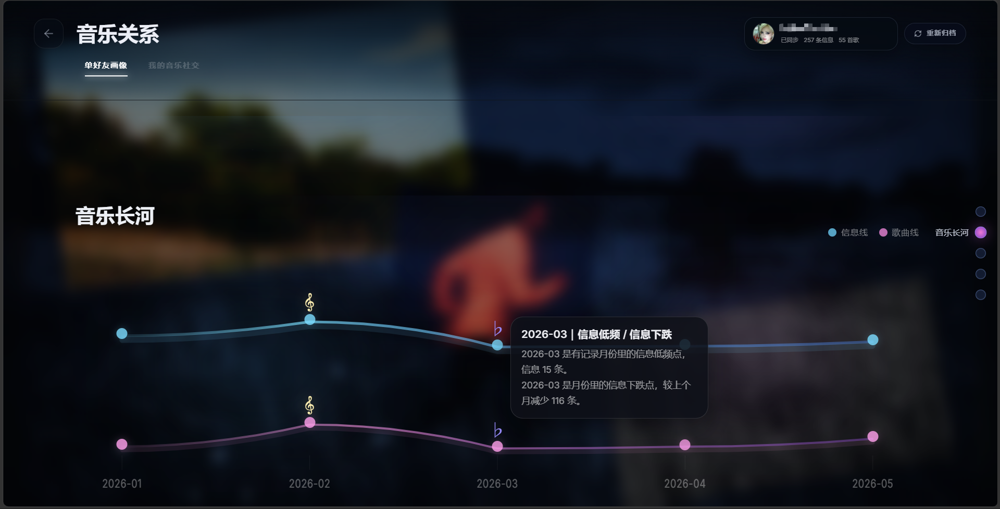
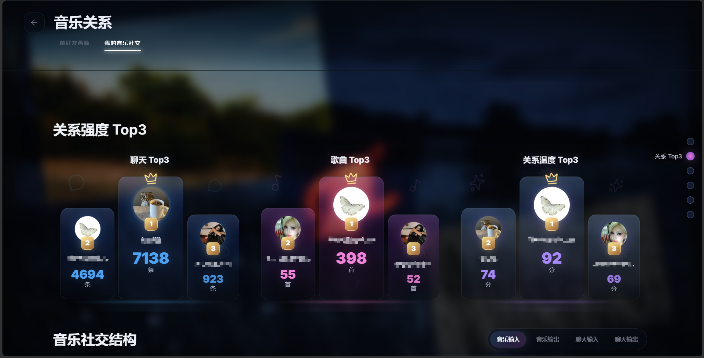
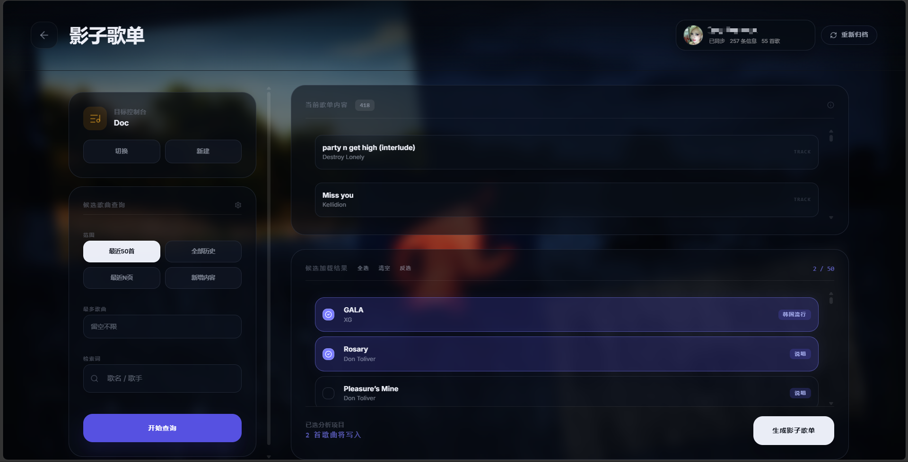

# Shadow

Shadow 是一个围绕网易云音乐私信与歌曲分享场景构建的本地化 Web 应用。它把聊天归档、音乐关系分析、影子歌单生成、未知歌曲最小字段贡献、公共映射增量更新串成一条完整体验，重点放在真实数据、隐私边界和可持续迭代上。

## 下载 / Release

项目打包版本可在这里下载：

[前往 Releases 页面](https://github.com/3061084478/shadow-showcase-public/releases)

## 项目亮点

- 本地优先：聊天归档、好友数据、SQLite 数据库、运行日志都落在本地目录，不依赖完整 SaaS 后台。
- 真实链路：前端、后端、网易云 API 网关、CloudBase unknown 收集、mapping delta 更新。
- 视觉统一：业务页采用深蓝夜景、暗色玻璃、冷色微光的产品化界面体系。
- 可维护：unknown 收集、mapping 发布、便携包打包、公共展示导出都拆成独立脚本和文档。

## 功能概览

### 二维码登录网易云音乐

 

### 首页好友同步、消息归档与 unknown 歌曲最小字段贡献

 

### 聊天记录查询与筛选

 

### 音乐关系分析与可视化：单好友关系

 

### 音乐关系分析与可视化：全局音乐社交

 

### 影子歌单生成

 

### 公共 `genre_mapping` 增量更新

支持公共曲风映射表的增量构建、发布。

## 目录说明

- `shadow-web`：前端源码。
- `shadow_music_site`：本地 Python 后端
- `shadow_music_models`：歌曲标签模型、映射与增量逻辑
- `cloudbase-functions`：CloudBase 云函数
- `tools`：导出 unknown、构建 mapping delta、打包便携包等脚本
- `docs`：面对外部读者整理后的项目说明
- `portable`：Windows 便携包模板

## 文档入口

- [产品总览](docs/overview.md)
- [前端设计与页面分区](docs/frontend-design.md)
- [本地架构与数据流](docs/local-architecture.md)
- [CloudBase 云端链路](docs/cloud-architecture.md)
- [映射模型与 Delta 发布流程](docs/mapping-pipeline.md)
- [隐私、安全与发布方式](docs/privacy-and-release.md)

